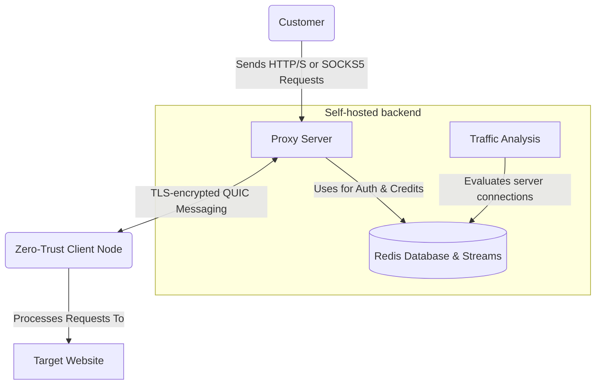

# Turbo

Turbo is a distributed residential proxy network.

This open-source infrastructure is designed for self-hosted, easy deployment via Docker Compose.
It is free for commercial use.

## Products

End-to-end encrypted HTTPS/SOCKS5 proxy network.

## System

