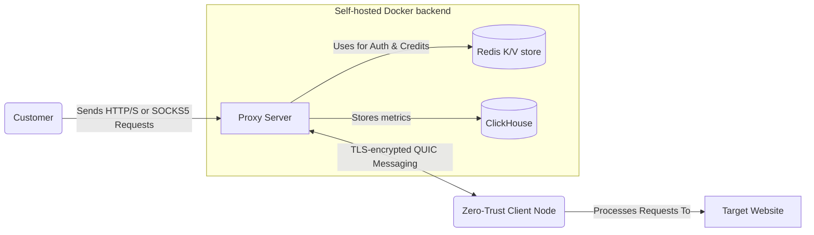

# Turbo
> **Fastest** and **cheapest** ~~decentralized~~ distributed residential proxy network.

This open-source infrastructure is designed for self-hosted, easy deployment via Docker Compose.
It is free for commercial use.

## Product

End-to-end encrypted HTTPS/SOCKS5 proxy network.

## System

